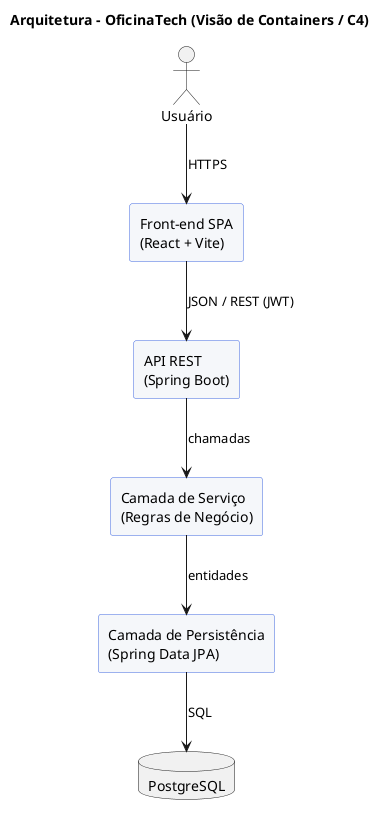

# 🔧 OficinaTech 👨‍💻

> [!NOTE]
> Sistema web de **gestão de ordens de serviço para oficinas mecânicas**. Centraliza agendamentos, diagnósticos, orçamentos, controle de estoque de peças e faturamento em um único lugar — reduzindo retrabalho e dando visibilidade total do fluxo de reparo ao gestor.

<table>
  <tr>
    <td width="800px">
      <div align="justify">
        O <b>OficinaTech</b> é uma aplicação para o gerenciamento completo do dia a dia de uma oficina mecânica. Ele conecta <i>clientes</i>, <i>atendentes</i>, <i>mecânicos</i> e <i>gestores</i> em torno de um fluxo único: do agendamento à entrega do veículo. O sistema controla o ciclo de vida da <b>Ordem de Serviço (OS)</b>, gera <i>orçamentos</i> aprováveis pelo cliente, baixa <i>peças</i> do estoque automaticamente e emite o <i>faturamento</i> ao final. O objetivo é eliminar o controle manual em papel/planilhas, reduzir erros de cobrança e dar ao gestor relatórios de produtividade e receita em tempo real.
      </div>
    </td>
    <td>
      <div>
        
      </div>
    </td>
  </tr>
</table>

---

## 🚧 Status do Projeto


[](#)


---

## 📚 Índice
- [Links Úteis](#-links-úteis)
- [Sobre o Projeto](#-sobre-o-projeto)
- [Funcionalidades Principais](#-funcionalidades-principais)
- [Tecnologias Utilizadas](#-tecnologias-utilizadas)
- [Arquitetura](#-arquitetura)
- [Instalação e Execução](#-instalação-e-execução)
  - [Pré-requisitos](#pré-requisitos)
  - [Variáveis de Ambiente](#variáveis-de-ambiente)
  - [Instalação de Dependências](#instalação-de-dependências)
  - [Inicialização do Banco de Dados (PostgreSQL)](#inicialização-do-banco-de-dados-postgresql)
  - [Como Executar a Aplicação](#como-executar-a-aplicação)
- [Deploy](#-deploy)
- [Estrutura de Pastas](#-estrutura-de-pastas)
- [Demonstração](#-demonstração)
- [Testes](#-testes)
- [Documentações utilizadas](#-documentações-utilizadas)
- [Autores](#-autores)
- [Contribuição](#-contribuição)
- [Agradecimentos](#-agradecimentos)
- [Licença](#-licença)

---

## 🔗 Links Úteis
* 🌐 **Demo Online:** [Acesse a Aplicação Web](https://oficinatech.vercel.app)
  > 💻 **Descrição:** Aplicação em ambiente de produção (hospedada na Vercel).
* 📖 **Documentação da API:** [Swagger / OpenAPI](https://api.oficinatech.com/swagger-ui.html)
  > 📚 **Descrição:** Documentação técnica completa dos endpoints REST.
* 🗂️ **Quadro do Projeto:** [Trello / Jira](https://trello.com/b/oficinatech)
  > 📋 **Descrição:** Acompanhamento de tarefas e backlog.

---

## 📝 Sobre o Projeto

O **OficinaTech** nasceu da dor real de pequenas e médias oficinas que ainda controlam serviços em cadernos e planilhas soltas, perdendo histórico de veículos e cometendo erros de cobrança.

- **Por que ele existe:** centralizar e digitalizar o fluxo de reparo de veículos.
- **Qual problema resolve:** falta de rastreabilidade das ordens de serviço, descontrole de estoque de peças e orçamentos sem aprovação formal do cliente.
- **Qual o contexto:** projeto **acadêmico** da disciplina *Projeto de Software*, simulando um sistema comercial real.
- **Onde pode ser utilizado:** oficinas mecânicas de pequeno e médio porte, centros automotivos e auto centers.

O sistema entrega valor ao **cliente** (acompanhar e aprovar orçamentos), ao **mecânico** (fila de serviços organizada) e ao **gestor** (relatórios de receita e produtividade).

---

## ✨ Funcionalidades Principais

- 📅 **Agendamento de Serviços:** cliente/atendente marca data e horário para entrada do veículo.
- 🚗 **Cadastro de Clientes e Veículos:** histórico completo por placa.
- 🧾 **Ordem de Serviço (OS):** abertura, acompanhamento de status e encerramento.
- 🔍 **Diagnóstico e Orçamento:** mecânico registra defeitos e gera orçamento detalhado.
- ✅ **Aprovação de Orçamento:** cliente aprova ou recusa antes da execução.
- 📦 **Controle de Estoque de Peças:** baixa automática ao consumir peça na OS.
- 💳 **Faturamento e Pagamento:** emissão de fatura e registro do pagamento.
- 📊 **Relatórios Gerenciais:** receita, serviços por mecânico e tempo médio de reparo.
- 🔐 **Autenticação e Perfis:** controle de acesso por papel (Atendente, Mecânico, Gerente).

---

## 🛠️ Tecnologias Utilizadas

| Camada | Tecnologia | Versão |
|---|---|---|
| **Back-end** | Java + Spring Boot | 17 / 3.2.5 |
| | Spring Data JPA / Hibernate | 6.x |
| | Spring Security (JWT) | 6.x |
| **Front-end** | React | 19.1.1 |
| | Vite | 5.x |
| | Axios / React Router | — |
| **Banco de Dados** | PostgreSQL | 16 |
| **Infra / DevOps** | Docker & Docker Compose | — |
| | GitHub Actions (CI/CD) | — |
| **Testes** | JUnit 5 + Mockito (back) | — |
| | Vitest + Cypress (front) | — |
| **Deploy** | Vercel (front) / Render (back) | — |

---

## 🏛️ Arquitetura

O OficinaTech adota uma arquitetura em **camadas (layered)** com back-end REST desacoplado do front-end SPA. O React consome a API do Spring Boot via HTTP/JSON, e o Spring Boot persiste no PostgreSQL através do Spring Data JPA.

> 📌 **Diagrama:** renderize o código PlantUML abaixo em [plantuml.com](https://www.plantuml.com/plantuml) e insira a imagem gerada logo após o bloco.



<!-- 👉 Cole aqui a imagem do diagrama de arquitetura renderizado -->
*(espaço reservado para a imagem do diagrama de arquitetura)*

---

## ⚙️ Instalação e Execução

### Pré-requisitos
- [Java JDK 17+](https://adoptium.net/)
- [Node.js 20+](https://nodejs.org/) e npm
- [PostgreSQL 16+](https://www.postgresql.org/) (ou Docker)
- [Docker e Docker Compose](https://www.docker.com/) (opcional, recomendado)
- [Maven 3.9+](https://maven.apache.org/)

### Variáveis de Ambiente

#### 1. Back-end (Spring Boot) — `backend/.env`
```env
SERVER_PORT=8080
DB_URL=jdbc:postgresql://localhost:5432/oficinatech
DB_USERNAME=postgres
DB_PASSWORD=postgres
JWT_SECRET=troque-esta-chave-secreta
JWT_EXPIRATION=86400000
```

#### 2. Front-end (React, Vite) — `frontend/.env`
```env
VITE_API_BASE_URL=http://localhost:8080/api
VITE_APP_NAME=OficinaTech
```

#### 3. Exemplo de Variáveis de Ambiente na Vercel
```env
VITE_API_BASE_URL=https://api.oficinatech.com/api
VITE_APP_NAME=OficinaTech
```

### Instalação de Dependências

#### Front-end (React)
```bash
cd frontend
npm install
```

#### Back-end (Spring Boot)
```bash
cd backend
mvn clean install
```

### Inicialização do Banco de Dados (PostgreSQL)
```bash
# Cria o banco local (psql)
createdb oficinatech

# OU via Docker
docker run --name oficinatech-db -e POSTGRES_DB=oficinatech \
  -e POSTGRES_PASSWORD=postgres -p 5432:5432 -d postgres:16
```

### Como Executar a Aplicação

#### Terminal 1: Back-end (Spring Boot)
```bash
cd backend
mvn spring-boot:run
# API disponível em http://localhost:8080
```

#### Terminal 2: Front-end (React, Vite)
```bash
cd frontend
npm run dev
# App disponível em http://localhost:5173
```

#### Execução Local Completa com Docker Compose (Incluindo Banco de Dados)
```bash
docker compose up --build
```

---

## 🚀 Deploy

| Componente | Plataforma | Observação |
|---|---|---|
| Front-end | **Vercel** | Build automático a cada push na `main` |
| Back-end | **Render** | Imagem Docker, deploy contínuo |
| Banco de Dados | **Render PostgreSQL** | Backup diário automático |

CI/CD via **GitHub Actions**: testes → build → deploy.

---

## 📂 Estrutura de Pastas

```
.
├── .gitignore                   # 🧹 Arquivos não versionados.
├── README.md                    # 📘 Documentação principal.
├── docker-compose.yml           # 🐳 Orquestração (front/back/db).
│
├── /frontend                    # 📁 Aplicação React + Vite
│   ├── .env.example
│   ├── package.json
│   └── src/
│       ├── components/          # Componentes reutilizáveis
│       ├── pages/               # Telas (OS, Agenda, Estoque)
│       ├── services/            # Chamadas à API (Axios)
│       └── routes/              # Rotas da aplicação
│
└── /backend                     # 📁 API Spring Boot
    ├── pom.xml
    └── src/main/java/com/oficinatech/
        ├── controller/          # Endpoints REST
        ├── service/             # Regras de negócio
        ├── repository/          # Spring Data JPA
        ├── model/               # Entidades (OrdemServico, Peca...)
        └── config/              # Segurança / JWT
```

---

## 🖼️ Demonstração

### 📱 Aplicativo Mobile
*(não aplicável — projeto web)*

### 🌐 Aplicação Web
> Insira aqui prints ou GIFs das telas principais (Dashboard, Ordem de Serviço, Estoque).

*(espaço reservado para capturas de tela)*

### 💻 Exemplo de saída no Terminal (Back-end)
```
  .   ____          _            __ _ _
 /\\ / ___'_ __ _ _(_)_ __  __ _ \ \ \ \
( ( )\___ | '_ | '_| | '_ \/ _` | \ \ \ \
 \\/  ___)| |_)| | | | | || (_| |  ) ) ) )
  '  |____| .__|_| |_|_| |_\__, | / / / /
 =========|_|==============|___/=/_/_/_/
 :: OficinaTech ::                (v1.0.0)

Started OficinaTechApplication in 4.21 seconds (JVM running for 4.8)
Tomcat started on port(s): 8080 (http)
```

---

## 🧪 Testes

### Testes Unitários (Back-end)
```bash
cd backend
mvn test
```
*Ferramenta utilizada: JUnit 5 + Mockito.*

### Testes Unitários (Front-end)
```bash
cd frontend
npm run test
```
*Ferramenta utilizada: Vitest.*

### Testes End-to-End (E2E)
```bash
npm run test:e2e
```
*Ferramenta utilizada: Cypress.*

---

## 🔗 Documentações utilizadas

* 📖 **Back-end:** [Documentação Oficial do **Spring Boot**](https://docs.spring.io/spring-boot/index.html)
* 📖 **Persistência:** [Guia do **Spring Data JPA**](https://docs.spring.io/spring-data/jpa/reference/)
* 📖 **Front-end:** [Documentação Oficial do **React**](https://react.dev/reference/react)
* 📖 **Build Tool:** [Guia de Configuração do **Vite**](https://vitejs.dev/config/)
* 📖 **Banco de Dados:** [Documentação do **PostgreSQL**](https://www.postgresql.org/docs/)
* 📖 **Diagramação:** [**PlantUML**](https://plantuml.com/)

---

## 👥 Autores

| Nome | Função | GitHub |
|---|---|---|
| `<Gabriel Peçanha Santiago>` | Desenvolvimento e Documentação | [@gabsant07](https://github.com/gabsant07) |

---

## 🤝 Contribuição

1. Faça um *fork* do projeto.
2. Crie uma branch: `git checkout -b feature/minha-feature`.
3. Commit: `git commit -m 'feat: minha feature'`.
4. Push: `git push origin feature/minha-feature`.
5. Abra um *Pull Request*.

---

## 🙌 Agradecimentos

Agradecimento ao **Prof. Dr. João Paulo Aramuni** pelo template de documentação e à comunidade open-source das tecnologias utilizadas.

---

## 📜 Licença

Este projeto está licenciado sob a licença **MIT** — consulte o arquivo [LICENSE](LICENSE) para detalhes.
